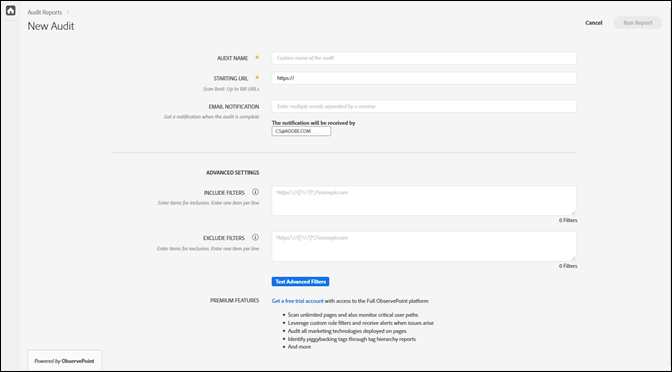

# Création d’un audit {#create-a-new-audit}

>[!NOTE]
>
>Les utilisateurs sont limités à l’exécution d’un audit à la fois. Une erreur se produit si vous essayez de lancer un audit avec les mêmes paramètres que celui en cours d’exécution. Afin d’en créer un autre, vous pouvez utiliser le lien contenu dans le message d’erreur pour annuler l’audit en cours.

Si vous le souhaitez, utilisez le lien au bas de la page pour accéder à un compte d’évaluation gratuit et complet avec ObservePoint.

1. Dans la liste d’Auditor, cliquez sur **[!UICONTROL New Audit]**.

   L’écran [!DNL New Audit] s’affiche.

   

1. (Obligatoire) Nommez l’audit.

   Le nom ne peut excéder 250 caractères.
1. (Obligatoire) Spécifiez l’URL de début.

   Le protocole est requis lors de la spécification de l’URL de début. L’URL de début est la page à partir de laquelle l’audit commence à analyser. Une fois démarré, Adobe Experience Platform Auditor analyse jusqu’à 500 pages, en suivant les liens qui commencent à l’URL de début. Consultez [Filtres d’inclusion et d’exclusion](../create-audit/filters.md) pour en savoir plus. L’URL de début ne peut excéder 250 caractères.

   >[!NOTE]
   >
   >Dans certains cas, analyser 500 pages peut prendre jusqu’à 48 heures.

1. Spécifiez une ou plusieurs adresses électroniques pour les notifications concernant cet audit.

   Vous pouvez indiquer plusieurs adresses en les séparant par une virgule. Par défaut, le demandeur est averti. Les adresses électroniques sont validées en temps réel. Si vous saisissez une adresse non valide, vous en êtes averti à l’écran.

   Chaque adresse électronique est limitée à 250 caractères maximum, fin de domaine incluse (par exemple, .com).

1. Specify [!UICONTROL Include Filters].

   Ce champ peut contenir des adresses URL exactes, des adresses URL partielles ou des expressions régulières. Utilisez ce champ pour les critères auxquels chaque URL doit correspondre. Any crawled URLs that do not match the [!UICONTROL Include Filter] criteria are not included in the audit results.

   Vous pouvez saisir les répertoires à analyser dans l’audit. Vous pouvez également effectuer un audit interdomaines ou d’autoréférence, pour lequel vous devez lancer l’audit sur un domaine et le terminer sur un autre. Pour ce faire, saisissez les domaines à parcourir. Pour les modèles d’URL complexes, utilisez une expression régulière.

   >[!NOTE]
   >
   >Si vous incluez une page dans vos filtres, mais qu&#39;elle n&#39;est pas connectée à votre URL de départ, ou que Platform Auditor analyse 500 pages avant d&#39;atteindre cette page, la page ne sera pas numérisée et ne sera pas incluse dans les résultats du test.

   Les filtres d’inclusion sont limités à 1 000 caractères par ligne.

   Consultez [Liste d’inclusion](../create-audit/filters.md) pour en savoir plus.
1. Spécifiez les filtres d’exclusion.

   The [!UICONTROL Exclude List] prevents URLs from being audited. Use exact URLs, partial URLs, or regular expressions, just as you would in the [!UICONTROL Include List].

   Une pratique courante consiste à exclure un lien de déconnexion si l’audit comporte une session utilisateur (par exemple : `/logout` signifie toute URL contenant la chaîne `/logout`).

   Les filtres d’exclusion sont limités à 1 000 caractères par ligne.

   Consultez [Liste d’exclusion](../create-audit/filters.md) pour en savoir plus.
1. (Facultatif) Si vous le souhaitez, vous pouvez tester les filtres d’inclusion et d’exclusion, ainsi que tester vos adresses URL.

   Saisissez les filtres et les adresses URL, puis cliquez sur **[!UICONTROL Apply]** pour exécuter le test.

   

1. Cliquez sur **[!UICONTROL Run Report]**.
