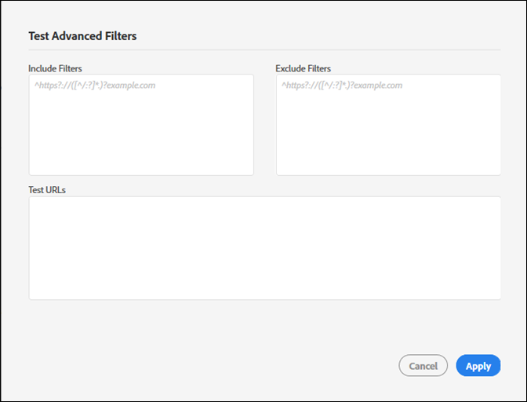

# Create a new audit{#create-a-new-audit}

>[!NOTE]
>
>Les utilisateurs sont limités à un audit exécuté à la fois. Une erreur se produit si vous tentez de lancer un audit avec les mêmes paramètres que celui en cours d’exécution. Vous pouvez utiliser le lien dans le message d’erreur si vous souhaitez annuler l’audit en cours d’exécution afin d’en créer un nouveau.

Si vous le souhaitez, utilisez le lien au bas de la page pour accéder à un compte d’essai gratuit et complet avec ObservePoint.

1. Dans la liste Auditeur, cliquez sur **[!UICONTROL Nouveau audit]**.

   The [!DNL New Audit] screen opens.

   

1. (Obligatoire) Attribuez un nom à la vérification.

   Le nom ne peut excéder 250 caractères.
1. (Obligatoire) Spécifiez l’URL de départ.

   Le protocole est requis lors de la spécification de l’URL de départ. L’URL de départ est la page sur laquelle l’audit commence à s’analyser. Une fois lancé, l’Auditeur analyse jusqu’à 500 pages, en suivant les liens qui commencent à l’URL de départ. Voir [Inclure et Exclure les filtres](../create-audit/filters.md#concept-23531490bb124981ba807ed1806e3257) pour plus d’informations. L’URL de départ peut contenir jusqu’à 250 caractères.

   >[!NOTE]
   >
   >Dans certains cas, il peut s’écouler jusqu’à 48 heures pour effectuer un scan de 500 pages.

1. Spécifiez une ou plusieurs adresses électroniques pour les notifications concernant cet audit.

   Vous pouvez spécifier plusieurs courriers électroniques en séparant chaque adresse par une virgule. Le demandeur est averti par défaut. Les adresses électroniques sont validées en temps réel. Si vous entrez une adresse non valide, vous en êtes averti à l&#39;écran.

   Chaque adresse électronique est limitée à 250 caractères maximum, y compris le domaine se terminant (par exemple, .com).
1. Spécifiez Inclure les filtres.

   Ce champ peut contenir des URL exactes, des URL partielles ou des expressions régulières. Utilisez ce champ pour les critères que chaque URL doit correspondre. Les URL analysées qui ne correspondent pas aux critères du filtre Inclure ne sont pas incluses dans les résultats de l’audit.

   Vous pouvez entrer les répertoires que vous souhaitez analyser par l&#39;audit. Vous pouvez également effectuer un audit interdomaine ou d’auto-référence, dans lequel vous devez démarrer l’audit sur un domaine et vous terminer sur un autre. Pour ce faire, saisissez les domaines que vous souhaitez parcourir. pour les modèles d’URL complexes, utilisez une expression régulière.

   >[!NOTE]
   >
   >Si vous incluez une page dans vos filtres, mais qu’elle n’est pas connectée à l’URL de départ, ou que l’Auditeur analyse 500 pages avant d’atteindre cette page, la page ne sera pas numérisée et ne sera pas incluse dans les résultats du test.

   Les filtres d’inclusion sont limités à 1 000 caractères par ligne.

   Pour plus d’informations, voir [Inclure la liste](../create-audit/filters.md#section-7626060a56a24b658f8c05f031ac3f5f) .
1. Spécifiez Exclure les filtres.

   La liste d’exclusion empêche les URL d’être contrôlées. Utilisez des URL exactes, des URL partielles ou des expressions régulières, comme vous le feriez dans la liste d’inclusion.

   Une pratique courante consiste à exclure un lien de déconnexion si l’audit comporte une session utilisateur (par exemple : `/logout`, ce qui signifie toute URL contenant la chaîne `/logout`).

   Les filtres d’exclusion sont limités à 1 000 caractères par ligne.

   Pour plus d’informations, voir [Exclure la liste](../create-audit/filters.md#section-00aa5e10c878473b91ba0844bebe7ca9) .
1. (Facultatif) Si vous le souhaitez, vous pouvez tester les filtres d’inclusion et d’exclusion et tester vos URL.

   Entrez les filtres et les URL, puis cliquez sur **[!UICONTROL Appliquer]** pour exécuter le test.

   

1. Cliquez sur **[!UICONTROL Exécuter le rapport]**.
