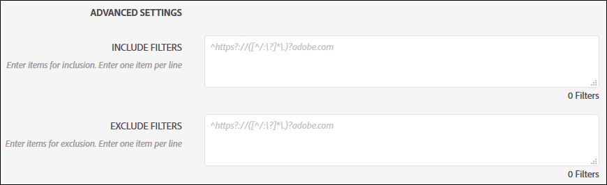
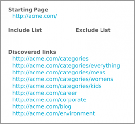
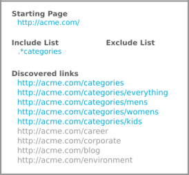
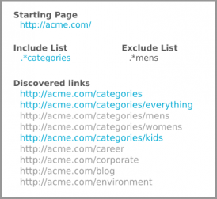
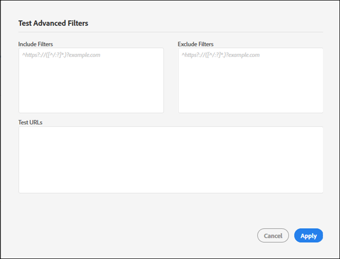

# Filtres Inclure et Exclure{#include-and-exclude-filters}

Les filtres d’inclusion limitent les liens qu’un audit peut analyser à partir de l’URL de début. Les filtres d’exclusion empêchent un audit d’analyser les liens.

<!--
Content from ObservePoint (https://help.observepoint.com/articles/2872121-include-and-exclude-filters) with their permission. Modified slightly for style and Auditor emphasis.
-->

Les filtres Inclure et Exclure fournissent des conseils pour les audits. En laissant les filtres Inclure et Exclure vides, un audit peut analyser tous les liens qu’il rencontre, en commençant par les liens sur l’URL de départ.



En appliquant les filtres Inclure, Exclure les filtres ou une combinaison des deux, des instructions sur les liens qu’un audit peut analyser peuvent être fournies.

Tout élément du champ Inclure les filtres limite l&#39;analyse aux seules pages qui correspondent à cet élément. Tout élément d’un champ Exclure les filtres empêche l’analyse des pages qui correspondent à cet élément.

Les filtres Inclure et Exclure peuvent être des URL complètes, des URL partielles ou des expressions régulières qui correspondent à une page valide.

## Ordre de priorité {#section-e9d42419dd3f459bb20e7a33c6104f12}

1. **Le début de l’URL** prévaut sur tout le reste et sera toujours visité lors d’un audit, même si une URL correspond à un élément dans les filtres Exclure. L’URL de départ est toujours consultée avant toute autre URL.

   

   Dans l’image ci-dessus, un audit détecte les liens à partir de la `document.links` propriété de la page de départ. Ces liens peuvent être analysés par la vérification.

1. **Les URL** d’inclusion doivent être liées à partir d’une page de démarrage, sinon elles ne peuvent pas être découvertes et ne seront pas visitées.

   

   Dans l’image ci-dessus, l’ajout d’un filtre Inclure limite les URL éligibles à celles qui correspondent au filtre. Désormais, seuls cinq liens peuvent être analysés par l’audit.

1. **Exclure les URL** élimine les liens de l’éligibilité.

   

   Dans l’image ci-dessus, l’ajout d’un filtre Exclure empêche les URL des liens éligibles. Maintenant, seuls trois liens peuvent être analysés par l&#39;audit.

## Démarrage de l’URL {#section-ccb46abcd96f4a8ab171245015d2b724}

L’Auditeur requiert une seule page pour l’URL de début. L’URL de départ est toujours consultée avant toute autre URL. Tout lien découvert à partir de la page de départ peut être visité, sous réserve des filtres Inclure et Exclure. Si un élément Exclure correspond à une URL de début, il est ignoré.

## Inclure les filtres {#section-7626060a56a24b658f8c05f031ac3f5f}

Les filtres Inclure limitent les liens pouvant être analysés au cours d’un audit. Les filtres d’inclusion peuvent être :

* URL complètes
* URL partielle
* Expressions régulières correspondant à des URL complètes ou partielles
* Toute combinaison des éléments ci-dessus

L’ajout d’URL ou d’expressions régulières au filtre Inclure ne garantit pas que ces URL spécifiques seront numérisées dans l’audit. L’audit examine les liens de l’URL de départ, puis parcourt les liens éligibles. L’audit poursuit ce processus d’inspection et de navigation jusqu’à ce que la limite de 500 URL numérisées soit atteinte ou jusqu’à ce qu’aucun autre lien admissible ne soit trouvé.

>[!NOTE]
>
>Dans certains cas, il peut s’écouler jusqu’à 48 heures pour effectuer un scan de 500 pages.

Par défaut, un audit analyse tous les sous-domaines de l’URL de départ. A moins d’être explicitement remplacé par un filtre d’inclusion, l’analyse utilisera le filtre d’inclusion regex suivant :

`^https?://([^/:\?]*\.)?mysite.com`

Ainsi, tout lien figurant sur la page URL de début peut être consulté. Il correspond à n’importe quelle page sur n’importe quel sous-domaine de l’URL de départ.

L’utilisation du filtre Inclure par défaut offre une large gamme d’analyses pour un audit. Pour accéder à certaines sections ou pages, indiquez des instructions spécifiques à votre audit en ajoutant des filtres dans cette zone. Dans ce cas, remplacez la valeur par défaut par les répertoires que vous souhaitez que le contrôle analyse. Vous pouvez également utiliser des filtres d’inclusion pour effectuer un audit inter-domaines dans lequel vous devez démarrer l’audit sur un domaine et vous terminer sur un autre. Pour ce faire, saisissez les domaines que vous souhaitez parcourir. Dans tous les cas, pour qu’une URL de filtre d’inclusion soit trouvée, elle doit être découverte sur une page qui est vérifiée.

Les filtres d’inclusion peuvent contenir des URL exactes, des URL partielles ou des expressions régulières. Par exemple, si l’URL de début est [!DNL http://mysite.com]définie, les pages suivantes peuvent être numérisées par défaut (notez les caractères en gras) :

```
http://mysite.com
http
<b>s</b>://mysite.com
http://
<b>www</b>.mysite.com/home
http://
<b>dev</b>.mysite.com/home
http://
<b>my</b>.mysite.com/products/products_and_services.html
```

Pour les modèles d’URL complexes, utilisez le testeur [d’expression régulière d’](http://regex.observepoint.com/)ObservePoint.

Consultez également le document Expressions régulières [communes pour ObservePoint](https://help.observepoint.com/articles/2872116-common-regular-expressions-for-observepoint) pour connaître les cas d’utilisation communs de correspondance de modèle.

## Exclure les filtres {#section-00aa5e10c878473b91ba0844bebe7ca9}

Les filtres Exclure empêchent l’audit des URL. Vous pouvez utiliser des URL exactes, des URL partielles ou des expressions régulières. Les URL qui correspondent à un élément dans les filtres Exclure ne sont pas visitées. Si votre URL de départ est incluse dans les filtres Exclure, elle n’est pas exclue. L’URL de début est toujours analysée par un audit.

## Test des filtres et des URL {#section-3cfa125b1756411395a64701e128efa0}

Vous pouvez tester vos filtres et URL dans l’auditeur.

Lors de la création de votre audit, cliquez sur **[!UICONTROL Tester les filtres]** avancés. Entrez vos filtres et URL, puis cliquez sur **[!UICONTROL Appliquer]**.



## Documentation d’ObservePoint {#section-79cdc8e850d047969b6d2badf6bbd6f9}

Cet article a été élaboré en collaboration avec ObservePoint. Pour obtenir les informations les plus récentes, reportez-vous à la documentation [ObservePoint](https://help.observepoint.com/articles/2872121-include-and-exclude-filters).
