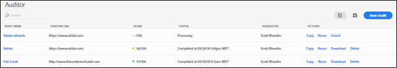
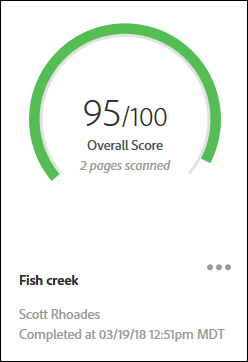
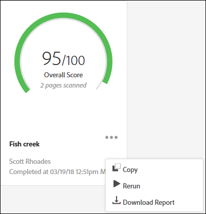

# Page Liste des audits {#audit-list-page}

La page Liste des audits affiche des informations sur tous vos audits.

Lorsque vous lancez Adobe Experience Platform Auditor, la page Liste des audits s’affiche. Vous pouvez consulter la page Liste des audits sous forme de liste ou de carte.

## Mode Liste {#section-a428749d2ab94a08bf460e6a486b844a}

Le mode Liste affiche les informations suivantes pour chacun de vos audits.

| Élément | Description |
|---|---|
| Nom de l’audit | Nom donné à l’audit |
| URL de début | L’URL à partir de laquelle l’audit commence à analyser les pages |
| Score | Les audits sont notés de 1 à 100, 100 signifiant qu’aucun problème n’a été détecté sur les pages analysées |
| État | Indique soit le moment où l’audit s’est terminé, soit qu’il est en cours de traitement |
| Demandeur | Affiche le nom de l’utilisateur ayant créé l’audit |
| Actions | Fournit des liens pour copier ou relancer l’audit, annuler un audit en cours d’exécution, télécharger un rapport sous forme de feuille de calcul [!DNL Excel] ou supprimer l’audit |

Cliquez sur le nom d’un audit pour en afficher les résultats.

## Mode Carte {#section-6826b585e53a46daa722b9bd3eda926e}

Le mode Carte affiche chaque audit dans un format graphique.

Cliquez sur le nom d’un audit pour en afficher les résultats. Cliquez sur le menu en regard du nom pour afficher les liens permettant de copier, de relancer ou d’annuler l’audit, ou de télécharger un rapport terminé sous forme de feuille de calcul [!DNL Excel] ou de PDF.

