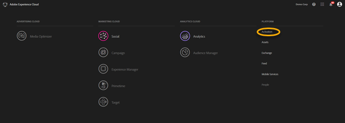
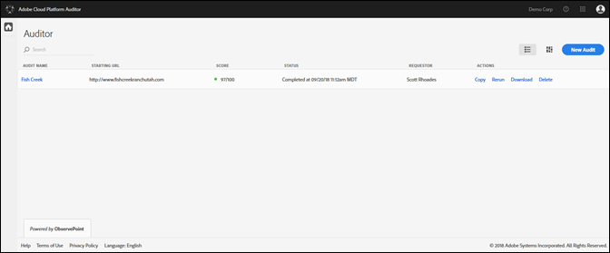
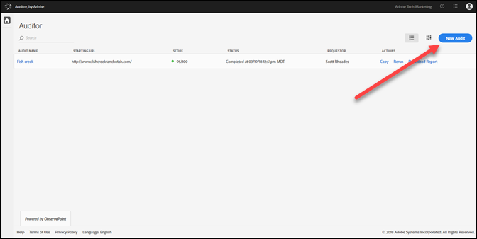
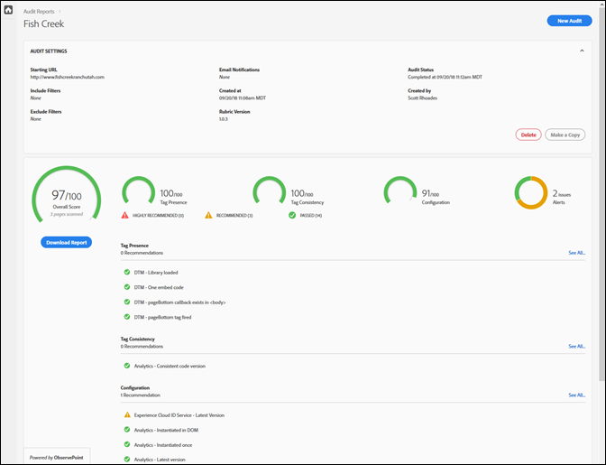

# Prise en main{#getting-started}

## Prise en main {#task-1024e94b5948413295c9698e62165a04}

<!--
This page is a placeholder for now, we need things like prerequisites, any planning that should be done before using Auditor, initial setup info--that kind of thing.
-->

La première fois que vous utilisez le vérificateur, vous devez remplir et accepter l&#39;entente du vérificateur. L’auditeur a été développé en tant qu’effort de coopération entre Adobe et ObservePoint. Les utilisateurs d’auditeurs peuvent utiliser la fonctionnalité ObservePoint limitée sans frais supplémentaires. Pour utiliser l&#39;auditeur, vous devez vous inscrire aux communications de ObservePoint.

## Exécution de votre première analyse {#task-b211597afed343cfa238443fcf7c6041}

1. Cliquez sur le bouton de menu dans le coin supérieur droit de la barre de navigation d’Adobe Experience Cloud et cliquez sur **[!UICONTROL Activation]**.

   

1. Sélectionnez Vérificateur et acceptez les conditions d’utilisation.

   La page Auditeur vous donne un tableau de bord des analyses précédentes, ainsi que la possibilité d’exécuter une nouvelle analyse.

   

1. Cliquez sur **[!UICONTROL Nouveau audit]**.

   Pour lancer une nouvelle analyse, cliquez sur **[!UICONTROL Nouvelle vérification]** dans le coin supérieur droit de l’écran.

   

1. Configuration de l’analyse.

   Attribuez un nom à l’audit, fournissez une URL de début, puis cliquez sur **[!UICONTROL Exécuter le rapport]**. Une fois votre analyse terminée, vous recevez une notification par courrier électronique.

   

   Pour une description de toutes les options de configuration, voir [Création d’un nouvel audit](../create-audit/create-new-audit.md#task-6d157f80e5264642b877c2820b1d077d).
1. Affichez votre rapport.

   Lorsque vous recevez le courrier électronique vous informant que l’analyse est terminée, cliquez sur le lien pour [afficher votre rapport](../reports/scorecard.md#concept-8958a64346c34f74844553dda1ccf869) et commencer à comprendre les opportunités d’amélioration de votre mise en oeuvre et d’optimisation de vos solutions Adobe.

   Vous pouvez également cliquer sur le nom de l’audit dans la page  Auditeur pour afficher le statut de l’audit et le rapport une fois l’audit terminé.

   
