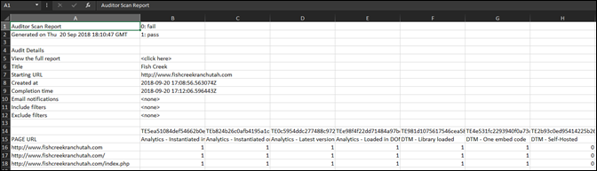

# Télécharger le rapport{#download-report}

Le rapport indique pour chaque URL si elle est transmise ou si elle a échoué.

Vous pouvez voir le rapport sur la page Scorecard de l’interface utilisateur. Vous pouvez également télécharger le rapport :

1. Dans la liste Adobe Experience Platform Auditor ou dans une fiche d’évaluation, cliquez sur **[!UICONTROL Télécharger le rapport]**.

   Vous pouvez télécharger le rapport sous forme de feuille de calcul ou au format PDF.
1. Indiquez si vous souhaitez ouvrir ou enregistrer le fichier.

1. Cliquez sur **[!UICONTROL OK]**.

   La feuille de calcul indique si chaque test a réussi ou échoué sur chacune de vos pages.

   

Le PDF affiche les informations suivantes :

* Paramètres de l’audit
* Horodatage de fin
* Score global
* Score par catégorie
* Tests unitaires appliqués avec les URL qui ont échoué
* Lien vers le document Recommandations et Aide par test
