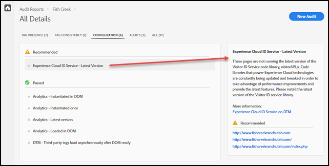

# Fiche d’évaluation {#scorecard}

Après l’exécution d’un test, la fiche d’évaluation affiche des informations sur l’audit.

Cliquez sur le nom de votre audit dans la page Adobe Experience Platform Auditor pour vue les résultats de votre test.

Utilisez la fiche d’évaluation pour voir les résultats obtenus par l’audit dans les catégories suivantes :

* Score global
* Présence des balises

   Évalue si la balise existe et si elle se trouve au bon endroit dans le code de la page.
* Cohérence des balises

   Évalue si les balises sont cohérentes entre les adresses URL.
* Configuration

   Évalue les balises en fonction d’autres règles et des bonnes pratiques recommandées.
* Alerte

   Les alertes indiquent les problèmes que vous devez connaître, mais qui n’affectent pas votre score.

Votre score dépend du poids de chaque test et de sa réussite ou son échec. Si vous obtenez une réussite, votre score augmente d’un nombre de points égal au poids du test.

* 0 : vous avertit au sujet de problèmes que vous devez connaître, mais qui n’affectent pas votre score.
* 1 : optimisation recommandée. Aucune incidence sur la précision des données.
* 2 : un échec signifie que vous n’aurez pas accès aux fonctionnalités et correctifs Adobe Experience Cloud les plus récents.
* 3 : teste l’efficacité et la conformité de l’implémentation aux bonnes pratiques vivement recommandées.
* 4 : un échec signifie que vous collectez peut-être des données non fiables.
* 5 : un échec signifie que vous pouvez subir une perte de données.

La fiche d’évaluation répertorie tous les problèmes de niveau 4 ou 5, pour lesquels une intervention est **vivement recommandée**.

La fiche d’évaluation répertorie tous les problèmes de niveau 1 à 3, pour lesquels une intervention est **recommandée**.

Cliquez sur **[!UICONTROL Télécharger le rapport]** pour télécharger un fichier ou PDF contenant les informations signalées par l’audit.[!DNL Excel]

Outre le score pour chaque catégorie, la fiche d’évaluation répertorie tous les correctifs recommandés ou fortement recommandés, ainsi que les éléments ayant réussi le test. Cliquez sur chaque problème pour afficher des détails supplémentaires dans la zone à droite. Cliquez de nouveau pour aller plus loin et consulter les recommandations proposées pour résoudre le problème. L’exemple suivant montre les détails d’un problème où l’intervention est recommandée. Ce dernier est issu de la fiche d’évaluation illustrée ci-dessus :

Cliquez sur les catégories dans la partie supérieure de l’écran pour afficher les problèmes rencontrés dans chaque catégorie.

## Quelles pages faisaient partie du test ? {#section-fd38ffeb868648e89c34c5772fa65f46}

Vous pouvez afficher la liste des adresses URL ayant réussi ou échoué pendant le test.

From the scorecard, click a test name or the **[!UICONTROL See All]** link under each category heading. Cela permet d’afficher les détails des tests. Pour chaque test, vous pouvez consulter la description du test et la liste des adresses URL qui ont échoué et réussi. Ces informations sont également incluses dans les rapports téléchargés.
